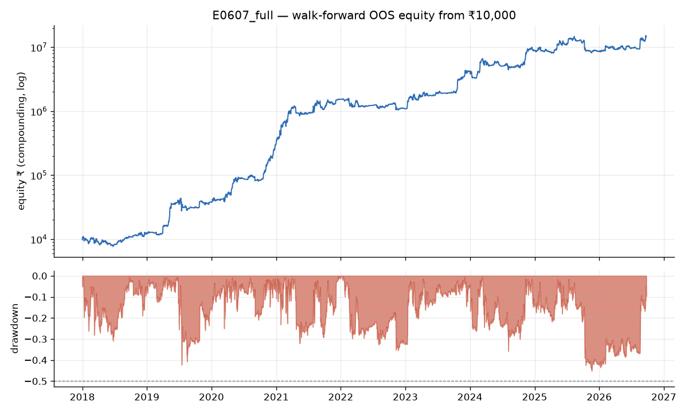
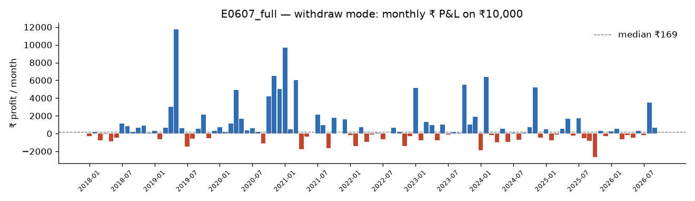
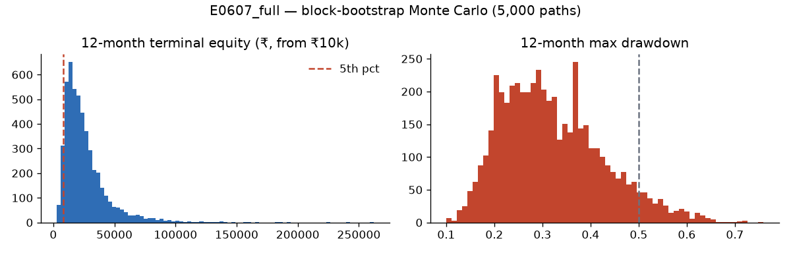

# Best indicator combination & buy/sell rules (maximising backtest profit)

**Answer:** **E0607**, an inverse-volatility blend of two systems, traded on Delta Exchange India's BTCUSD perp at
1.75x with maker-limit execution:
- **Combo L/S:** a walk-forward-selected *combination-of-indicators* long/short system on 4h bars.
- **E0449:** the earlier funding / vol-regime / ML ensemble on 1h bars.

On the **full 2018-01 → 2026-09 walk-forward**, where every period is out-of-sample for its own parameter choices,
**₹10,000 grew to ₹1.44 crore: CAGR 119.6%, max drawdown 45.8%, Sharpe 1.63**, with no liquidation.
Fees, slippage, funding and 0.001 BTC lot rounding are all included.

| | E0607 best (1.75x) | E0608 balanced (2x) | E0449 previous best | BTC buy & hold (spot) |
|---|---|---|---|---|
| CAGR 2018-01 → 2026-09 | **119.6%** | 110.5% | 46.1% | 23.5% |
| Max drawdown | 45.8% | 47.4% | 63.0% | 81.6% |
| ₹10,000 became | **₹1,44,30,165** | ₹99,88,943 | ₹4,11,870 | ₹94,597 |
| Sharpe / Sortino / Calmar | 1.63 / 2.33 / 2.61 | 1.64 / 2.30 / 2.33 | — | 0.7 / — / — |
| Year returns 2018 / 19 / 20 / 21 / 22 / 23 / 24 / 25 / 26 YTD | +22% / +212% / +700% / +407% / −29% / +286% / +109% / −3% / +69% | +87% / +216% / +665% / +354% / −30% / +228% / +40% / −7% / +62% | −11 / +83 / +373 / +127 / −23 / +96 / +74 / −6 / −4 % | −71 / +102 / +315 / +63 / −60 / +158 / +128 / −2 / +3 % |
| Withdraw mode (₹10k reset monthly): median / mean month | ₹169 / ₹799 | ₹169 / ₹797 | — | — |
| Trades / time in market | 778 / 80% | 765 / 58% | — | 1 / 100% |

**Scale check.** Even the best result is nowhere near ₹1,00,000/month on ₹10,000: the median withdraw-mode month is
₹169. The high CAGR comes from **compounding**. In compounding mode, monthly profit first reached ₹1L in **Dec 2020**,
when the account had grown to about ₹2 lakh (a +50% month). After that, **46% of months** made ≥ ₹1L.

---

## Exact rules (what to buy and sell, and when)

### System A: combo long/short on 4h bars (E0528 selection rules; 50–65% of the blend)
Every 6 months (1 Jan / 1 Jul):
1. **Rank 8,926 long combinations.** A combination is an AND of 1–3 conditions, drawn from 76 indicator conditions
   (listed below). Rank them by total return over the previous **4 years**, costed at taker + slippage. **Keep the top 5.**
2. **Pick 1 short combination.** Rank 8,926 short combinations (the same indicators on the mirrored price, plus
   crowded-funding and greed filters) by Sortino ratio over the previous 4 years. **Keep the top 1.**

On every 4h close:
- **Long target** = (number of the 5 long combinations that are TRUE) ÷ 5, rounded to 0.25.
- **Short target** = −1 if the short combination is TRUE, else 0.
- **Combo target** = long + short.

**Current window (2026-07-01 → 2026-12-31)**

| Side | Combinations (all conditions must hold at the 4h close) | True on 2026-09-26 |
|---|---|---|
| LONG 1 | 4h EMA20 > EMA50 **and** daily close > close 42 days ago | ✅ |
| LONG 2 | 4h EMA20 > EMA50 **and** daily 42-day momentum > 0 **and** Fear & Greed < 75 | ✅ |
| LONG 3 | 4h close > SMA200 **and** daily 42-day momentum > 0 | ✅ |
| LONG 4 | daily close > SMA50 **and** daily 42-day momentum > 0 | ✅ |
| LONG 5 | daily 42-day momentum > 0 **and** daily RSI(14) > 50 | ✅ |
| SHORT | **daily EMA50 < EMA200** (bear market) **and** 4h close < lower Bollinger band (20, 2) **and** funding > −0.01%/8h | ❌ |

**What the walk-forward picked most often, 2018–2026.** Long: funding < 0.03%/8h (60 of 90 picks), 4h EMA50 > EMA200,
30-day momentum > 0, daily close > SMA100, daily EMA12 > EMA26, daily MACD > 0. Short: breakdown below the lower
Bollinger band, crowded funding (> 0.01% or above its average), a daily death cross, and 30-day momentum < 0.
In plain words: **buy strength when funding is not crowded; short breakdowns only inside a confirmed bear market.**

The 76 conditions are:
- **Trend:** SMA 20/50/100/200, EMA crosses 12/26, 20/50 and 50/200, MACD, Supertrend 10×3 / 10×2 / 20×3, Donchian mid,
  DMI/ADX, Ichimoku cloud and tenkan/kijun, PSAR, HMA, KAMA, momentum 7d/30d, Heikin-Ashi.
- **Oscillators:** RSI 14 and 2, Stochastic, CCI, MFI.
- **Volume:** OBV, volume z-score, taker-buy ratio.
- **Volatility:** vol percentile, Bollinger squeeze and breakouts, Keltner.
- **Funding, sentiment and calendar:** funding level and z-score, Fear & Greed, turn-of-month, weekday.
- **Daily-timeframe versions** of the trend set.

### System B: E0449 on 1h bars (35–50% of the blend)
Three votes, weighted by inverse volatility, rounded to 0.25, ×2 (target 0–2):
- **Funding filter:** long while the last 8h funding is < 0.1%.
- **Vol-regime trend:** 4h SMA60 > SMA300 and 20-bar volatility above its 1-year median.
- **ML meta-label:** 4h SMA60 > SMA300, and a LightGBM model's P(trade profitable over 72h) > 0.45; the model is retrained
  every 6 months with purged CV.

See `reports/final_report.md` §1 for details.

### Blend, size and execution (E0607)
1. **Blend.** Map A's 4h target onto 1h bars at the 4h close, with no look-ahead.
2. **Weights.** w_A, w_B ∝ 1 / (volatility of each system's hourly returns over the last 60 days). On 2026-09-26: 0.64 / 0.36.
3. **Target leverage** = round((w_A·A + w_B·B) / 0.25) × 0.25 × **1.75**. It ranges from −1.75x (full short) to +3.5x.
   It is mostly between −1.75x and +1.75x, because B's 2x only adds when both systems agree.
4. **When to buy/sell.** Re-evaluate at every 1h close. **If the target changed:** place a **LIMIT order at that close
   price** for the difference. If it hasn't filled by the next hourly close (price never traded ≥ 1 bp through it),
   send a **MARKET order** at the following open.
5. **Size.** Contracts = floor(|target| × equity ÷ price ÷ 0.001 BTC).
6. **Exits.** No stop-loss or take-profit: exits happen when the target changes. The tested fixed 5% and 10% stops
   *reduced* profit (CAGR 44% → 23% / 42%).

`python signals/generate_signal.py` prints all of this live: combo truth values, weights, the action (BUY/SELL/HOLD/CLOSE),
the limit price, contracts and liquidation price. `--paper` logs hypothetical fills. On 2026-09-26 08:00 UTC it said:
**HOLD at +1.75x (2 contracts on ₹10k)**.

---

## How we got here (what increased profit, measured)

| Step | Idea | CAGR / max DD (walk-forward OOS) |
|---|---|---|
| 0 | Previous best (E0449, market orders), full period | 46% / 63% |
| 1 | Search 8,926 long indicator combinations on 4h; walk-forward top-5 (E0527) | 35% / 42% (dev) |
| 2 | **Add a mirrored short side** for bear markets (E0528) | 44.5% / 37% (dev); **+17% in the bear year** |
| 3 | Other timeframes: 1h (E0532), 1d (E0536) | worse: 30.5% / 55%, 15% / 61% |
| 4 | **Blend with E0449** (E0543): the signals are different, so risk-adjusted return rises | Sharpe 1.24 → 1.53 |
| 5 | Vol-target overlay | helped dev, **hurt the last year** (rejected) |
| 6 | Turnover cuts (coarser steps, hysteresis, 4h/24h cadence) | no gain (signal lost ≈ costs saved) |
| 7 | **Maker-limit execution** with a pessimistic trade-through fill and market fallback | full period 97% → **129–139%**, DD 50% → 45% |
| 8 | Leverage from the frontier: largest round step with full-period DD ≤ 50% | **1.75x → CAGR 119.6%, DD 45.8% (E0607)** |

Costs matter most. At 1.75x the blend turns over its equity ~2,200× in 8.7 years, so taker fees + slippage cost about
60 percentage points of CAGR. Limit orders recover most of that.

### Leverage vs profit (E0595, full period, limit execution)

| Leverage | 1.0 | 1.25 | 1.5 | **1.75** | 2.0 | 2.25 | 2.5 |
|---|---|---|---|---|---|---|---|
| CAGR | 67% | 87% | 108% | **129%** | 151% | 174% | 197% |
| Max DD | 29% | 35% | 41% | **46%** | 51% ✗ | 55% ✗ | 60% ✗ |
| ₹10k became | ₹13L | ₹35L | ₹88L | **₹2.1Cr** | ₹4.6Cr | ₹9.9Cr | ₹20Cr |
| Last year | −6% | +8% | +13% | +9% | +7% | +3% | +8% |

More leverage keeps raising backtest profit, but DD passes 50% above 1.75x. The E0607 row in the headline differs
slightly (CAGR 119.6%) because it applies the leverage before rounding to contract steps.

---

## Robustness gates (E0607)

| Gate | Result |
|---|---|
| Fast engine vs independent event engine (limit fills included): compound & withdraw | agree to ~1e-15 |
| 1-minute intrabar replay, full period (Mar-2020, May-2021, Nov-2022, Aug-2024, **Oct-10-2025**) | identical (₹1,44,30,165), 0 liquidations |
| 3× fees and slippage | CAGR 91.8% (full period) |
| Signals delayed one extra bar (leakage audit) | CAGR 111.8%: no collapse |
| Plateau ±20% | pass: `step` 99–105%, `lev` 77–129%. Combo selection parameters (top-k, training years): 76–103% |
| Monte Carlo (5,000 block-bootstrap years) | P(ruin) 0.0%, P(DD ≥ 50%) 6.5%, 5th-percentile year 0.85× |
| Trade-order reshuffle | **P(DD ≥ 50%) 51%**: the historical path was relatively smooth, and a different order of the same trades could easily breach 50% |
| Regimes (compound return) | 2018 +12%, 2019 +204%, 2020 +682%, 2021 +397%, 2022 −36%, 2023–24 +679%, 2025+ +46%. No single regime > 50% of profit |
| Worst drawdown | −46%, Oct 2025 → Jan 2026, recovered to a new high by Sep 2026 |

---

## Honest caveats (read before trading)

1. **This is the best of a large search.** N ≈ 24,500 configurations, 608 experiments, plus design choices made after
   seeing results: the execution mode, the blend, and the leverage. Deflated Sharpe ≈ 0 and ensemble-family PBO ≈ 0.8.
   Expect live results to be **well below** the backtest.
2. **No pristine holdout remains.** The original lockbox was spent in Section 8. The combo method was designed after
   that and never tuned on the last year. But the last year *was* used to choose between candidates, so treat it as
   quasi out-of-sample. The only clean test now is forward **paper trading** (`--paper`).
3. **Limit-fill model.** It assumes you get filled whenever price trades ≥ 1 bp through your limit within the hour.
   Real queue position, API latency and partial fills can do worse. Under market-only execution the same blend earned
   CAGR 97% at 50% DD.
4. **Lot granularity at ₹10k.** Positions are 0–4 contracts of 0.001 BTC. Sizes round down, and small targets become 0.
5. **Proxy data.** Delta's own funding history is unavailable (Binance/BitMEX used instead). The live generator uses
   Binance spot klines while the research used perp klines.
6. **Path risk.** The trade reshuffle shows about a 50% chance of a ≥50% drawdown for the same edge in a different
   order, so size so that a halving of the account is survivable.

Data: `reports/combo_full_results.json`, `reports/combo_full_period.csv`, `reports/combo_finalist_gates.json`,
`reports/combo_picks.json`, `reports/post_lockbox_quick.csv`. Every experiment is in `experiments/leaderboard.csv`
(E0527–E0608).
Charts:
- 
- 
- 
