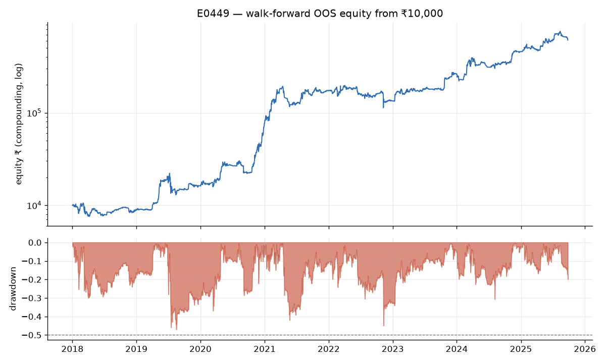
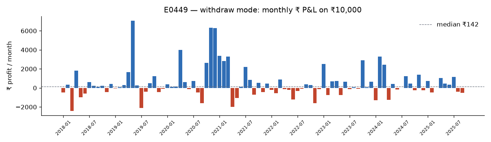
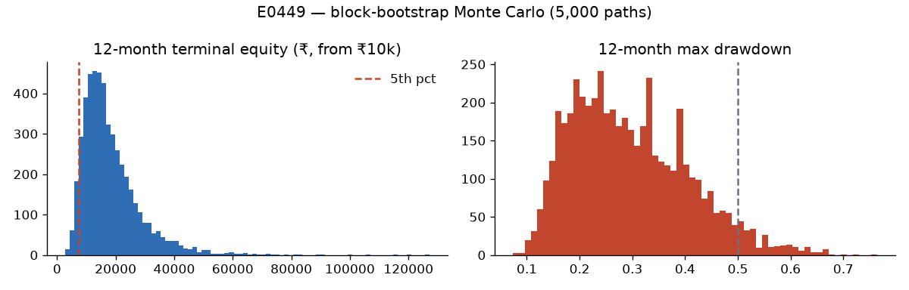
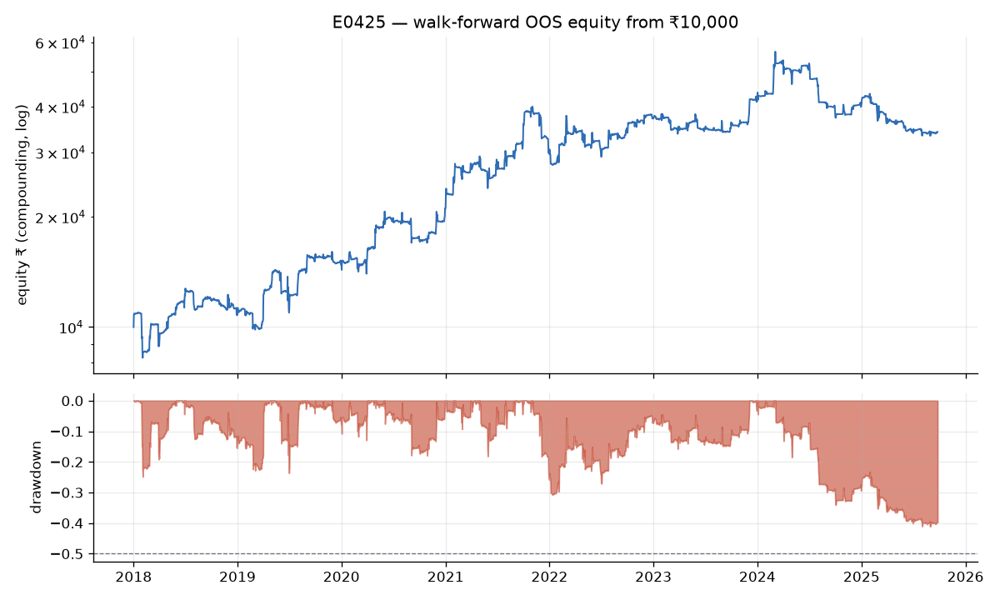
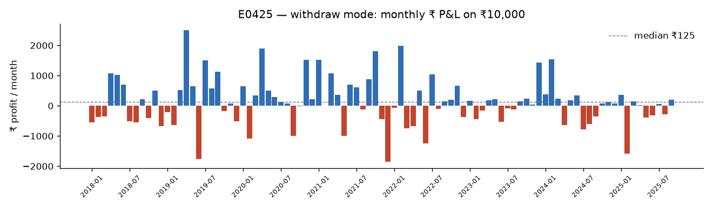
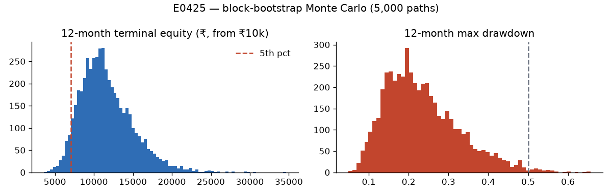
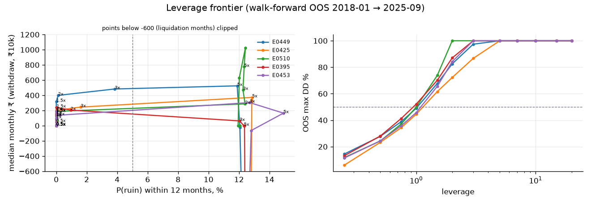

# Final report: BTC on ₹10,000 → ₹1,00,000/month?

**Verdict: target not met, and not reachable within the risk limits. Stop condition B (ceiling proven) holds.**
- **Best result:** the top walk-forward strategy within the limits (ensemble **E0449**) earned a median **₹142/month on ₹10,000** out-of-sample, 2018-01 → 2025-09. That is 0.14% of the target.
- **Lockbox:** on the sealed final 12 months (2025-09-26 → 2026-09-25) it **lost 24.5%**, with a median month of ₹0 (BTC fell 22.8% over the same year).
- **Capital needed:** earning ₹1,00,000/month at E0449's OOS median monthly return (2.25%, lot-free) would need **≈ ₹44 lakh**, and nothing supports assuming even that rate going forward.

Research budget: **526 experiments, N = 6,549 configurations** (every row is in `experiments/leaderboard.csv`).
E0001–E0212 were superseded by a bug fix and re-run as E0213–E0424 (see "Audit trail"). Ceiling evidence: `reports/ceiling.md`.

---

## 1. The strategy (ranked #1 within the risk limits): E0449

**In plain English.** Hold a long-only BTC perpetual position on Delta Exchange India. Size it from three
independent "is it a good time to be long?" votes, and trade only when the combined vote changes.

| Component | Timeframe | Rule (all computed on closed bars only) | Parameters chosen by walk-forward (grid) |
|---|---|---|---|
| C1 funding filter (E0301) | 1h | long while the last known 8h funding rate (lagged one bar) is below `hi`. Crowded, expensive longs are avoided | `hi` ∈ {0.005%, 0.01%, 0.02%, 0.04%, 0.1%} per 8h |
| C2 vol-regime trend (E0292) | 4h | long while SMA(fast) > SMA(slow) **and** the 20-bar realised-vol percentile (over the last 2,190 bars ≈ 1 year) > `vol_q` | fast ∈ {60,120}, slow ∈ {300,600}, vol_q ∈ {0.5,0.7,0.85} |
| C3 ML meta-label (E0420) | 4h | primary = SMA(60) > SMA(300). Take it only if a LightGBM model gives P(primary trade profitable over the next 18 bars) > `thr`. Model retrained every 1 Jan / 1 Jul on the prior 3 years with purged + embargoed 4-fold CV | thr ∈ {0.45,0.5,0.55,0.6} |

**Combination.** Map the 4h votes to 1h with no look-ahead (a 4h decision becomes tradable at the next 1h open after
the 4h close). Weight the votes (equal, or inverse to each component's trailing 60-day hourly return volatility,
lagged; chosen per window). Round to 0.25 and multiply by 2, so **target leverage ∈ {0, 0.5, 1.0, 1.5, 2.0}×.**

**Execution.** Delta Exchange India BTCUSD perpetual, taker market order at the next 1h open, rebalance only when the
target changes. Size is rounded down to whole 0.001 BTC contracts, so at ₹10,000 the position is 0–2 contracts.
No stop-loss or take-profit: the exit is the target going to 0. Cross margin: liquidation loses everything.

**Selection procedure (frozen at git tag `lockbox-freeze`).** Every 6 months (1 Jan / 1 Jul) each component re-picks its
parameters by the best training-window median monthly return on the previous 3 years. It is penalised if the training
max DD > 50%. The ensemble re-picks its weighting the same way. Selections used OOS are listed in `reports/finalists/E0449.json`.
Parameters for the current window (2026-07 → 2026-12): C1 `hi`=0.1%, C2 fast 60 / slow 300 / vol_q 0.5
(mode trend_highvol), C3 thr 0.45, weighting inverse-vol.

---

## 2. Out-of-sample metrics (walk-forward, stitched OOS 2018-01-01 → 2025-09-25, Delta India costs)

| Metric | E0449 ensemble (#1) | E0425 turn-of-month (#2 family) | E0395 funding filter |
|---|---|---|---|
| Median monthly profit, withdraw mode (₹10k reset monthly) | **₹142** | ₹125 | ₹107 |
| Mean monthly profit | ₹509 | ₹130 | ₹221 |
| Months ≥ ₹1,00,000 | **0%** | 0% | 0% |
| Worst month | −₹2,415 | −₹1,850 | −₹2,485 |
| OOS CAGR (compounding) | 63.1% | 12.3% | 24.3% |
| Max drawdown (compounding) | 49.1% | 44.6% | 46.2% |
| Sharpe / Sortino / Calmar | 1.25 / 1.58 / 1.29 | 0.53 / 0.44 / 0.28 | 0.78 / 0.83 / 0.53 |
| Trades / exposure / win rate | 639 / 70% / 48% | 93 / 28% / 49% | 575 / 45% / 50% |
| Compounding: first month ≥ ₹1L; share of later months ≥ ₹1L | 2024-11 (equity ≈ ₹5L); 18% | never | never |
| Final compounding equity from ₹10,000 | ₹6.10 lakh | ₹34,138 | ₹74,688 |
| **Capital needed for ₹1L/month** at OOS median (lot-free) | **₹44.4 lakh** (2.25%/mo) | ₹1.04 crore (0.96%/mo) | ₹69.4 lakh (1.44%/mo) |
| Monte Carlo (5,000 block-bootstrap 12-month paths): P(ruin <10%) / P(DD≥50%) / 5th-pct terminal | 0.0% / 4.9% / 0.77× | 0.0% / 0.7% / 0.71× | 0.0% / 2.5% / 0.70× |
| Trade-order reshuffle (5,000): P(DD≥50%) / 95th-pct DD | **39% / 64%** | 16% / 57% | 26% / 60% |
| 3× fees + slippage: median month / CAGR | **−₹118 / 8.6%** | ₹84 / 6.8% | ₹0 / −2.5% |
| Signals delayed +1 bar: median / CAGR (leakage audit) | ₹83 / 57.0% (no collapse) | ₹112 / 11.8% | ₹92 / 25.0% |
| Plateau test (each param ±20%, retention ≥70%) | pass (min 75%) | pass | pass (but `hi`×1.2 → DD 64%) |
| Deflated Sharpe (N=6,549) | ≈0.00 | ≈0.00 | ≈0.00 |
| PBO (CSCV) | 0.80 (across the 42-member ensemble family) | 0.86 (own grid); 0.05 across the calendar family | 0.55 |
| Fast engine vs event engine (compounding & withdraw) | agree to 1e-14 (limit 2%) | agree to 1e-14 | agree to 1e-14 |
| 1-minute intrabar replay (all OOS incl. Mar-2020, May-2021, Nov-2022, Aug-2024) | identical, 0 liquidations | identical, 0 liquidations | identical, 0 liquidations |

Sanity alarms (Sharpe > 3 on daily, > 50%/month): none triggered.

**Reading the numbers honestly.**
- **Deflated Sharpe.** It is ≈0 for every strategy: after 6,549 configurations, a Sharpe of 1.25 over 7.7 years is not
  statistically distinguishable from the best of many random strategies.
- **PBO.** A PBO of 0.80 across the ensemble family means that picking "the best ensemble" in-sample mostly picks luck.
- **Trade-order reshuffle.** It shows a 39% chance of a ≥50% drawdown for E0449 if the same trades had come in a different order.

### Regime breakdown (withdraw-mode ₹ sum / median month / compounding return)

| Regime | E0449 | E0425 | E0395 |
|---|---|---|---|
| 2018 | −₹1,158 / ₹160 / −18.6% | ₹119 / −₹359 / −1.1% | −₹505 / ₹284 / −19.2% |
| 2019 | ₹7,995 / ₹164 / +78% | ₹3,669 / ₹298 / +31% | ₹9,638 / ₹454 / +133% |
| 2020 | ₹19,003 / ₹497 / +362% | ₹3,522 / ₹254 / +39% | ₹3,571 / ₹179 / +41% |
| 2021 | ₹9,498 / ₹497 / +122% | ₹3,554 / ₹482 / +37% | ₹3,851 / ₹0 / +50% |
| 2022 | −₹2,921 / −₹178 / −31% | ₹1,334 / ₹33 / +9% | −₹2,273 / −₹362 / −24% |
| 2023–24 | ₹12,616 / ₹243 / +230% | ₹1,677 / ₹106 / +5% | ₹4,918 / ₹133 / +81% |
| 2025 (to Sep) | ₹2,311 / ₹348 / +29% | −₹1,778 / ₹25 / −19% | ₹1,379 / ₹0 / −1% |

No strategy earns more than 50% of its profit in one regime. The largest share is E0449's 2020, at 37%. All three lose in bear
regimes (2018, 2022), E0425 excepted in 2022.

### Monthly ₹ P&L: E0449, withdraw mode (₹10,000 each month)

| Year | Jan | Feb | Mar | Apr | May | Jun | Jul | Aug | Sep | Oct | Nov | Dec | Year |
|---|---:|---:|---:|---:|---:|---:|---:|---:|---:|---:|---:|---:|---:|
| 2018 | -461 | 357 | -2,415 | 1,814 | -991 | -600 | 626 | 208 | 111 | 218 | -436 | 412 | -1,158 |
| 2019 | -57 | 83 | 283 | 1,675 | 7,069 | 244 | -2,113 | -401 | 514 | 1,236 | -456 | -84 | 7,995 |
| 2020 | 398 | 109 | 142 | 4,003 | 596 | -137 | 721 | -489 | -1,601 | 2,649 | 6,331 | 6,282 | 19,003 |
| 2021 | 3,386 | 2,829 | 3,309 | -1,983 | -1,066 | 123 | 2,203 | 841 | -709 | 527 | -429 | 468 | 9,498 |
| 2022 | -219 | -558 | 871 | -129 | -213 | -1,205 | -303 | -84 | 376 | 292 | -1,607 | -142 | -2,921 |
| 2023 | 2,507 | -741 | 691 | 721 | -766 | 639 | -119 | 56 | -69 | 2,910 | 78 | 664 | 6,570 |
| 2024 | -1,282 | 3,289 | 2,442 | -1,246 | 408 | -159 | -26 | 1,245 | 460 | -248 | 1,387 | -223 | 6,047 |
| 2025 | 724 | -485 | 0 | 1,032 | 454 | 348 | 1,140 | -386 | -516 |  |  |  | 2,311 |

The best single month in 93 was ₹7,069, which is 7% of the ₹1,00,000 target.

### E0425 turn-of-month (runner-up family; the least overfit leader): monthly ₹ P&L

Rule: long 1x BTC perp from the open of the 4th-last calendar day of each month to the close of the 4th day of the next
(`tom` ∈ {1..5} re-picked every 6 months; 4 in most windows). Otherwise flat.

| Year | Jan | Feb | Mar | Apr | May | Jun | Jul | Aug | Sep | Oct | Nov | Dec | Year |
|---|---:|---:|---:|---:|---:|---:|---:|---:|---:|---:|---:|---:|---:|
| 2018 | -557 | -368 | -350 | 1,071 | 1,026 | 705 | -521 | -540 | 227 | -405 | 501 | -671 | 119 |
| 2019 | -205 | -631 | 524 | 2,507 | 644 | -1,763 | 1,506 | 569 | 1,131 | -174 | 72 | -512 | 3,669 |
| 2020 | 647 | -1,091 | 345 | 1,901 | 503 | 286 | 125 | 68 | -992 | -19 | 1,526 | 223 | 3,522 |
| 2021 | 1,528 | 8 | 1,073 | 354 | -988 | 709 | 609 | -128 | 884 | 1,801 | -445 | -1,850 | 3,554 |
| 2022 | -74 | 1,993 | -745 | -677 | 513 | -1,238 | 1,047 | -110 | 139 | 193 | 661 | -368 | 1,334 |
| 2023 | 170 | -449 | -159 | 175 | 220 | -526 | -77 | -116 | 148 | 240 | 34 | 1,435 | 1,094 |
| 2024 | 374 | 1,534 | 233 | -646 | 175 | 350 | -774 | -595 | -348 | 67 | 129 | 82 | 582 |
| 2025 | 359 | -1,583 | 143 | 25 | -389 | -308 | 60 | -282 | 197 |  |  |  | -1,778 |

Note the edge decaying: 2023–2025 are much weaker than 2019–2021.

### Charts

- E0449 equity & drawdown: 
- E0449 monthly ₹: 
- E0449 Monte Carlo: 
- E0425:   
- Leverage frontier (top 5): 

### Leverage frontier (top 5; multiplier on each strategy's own scale; CSVs in `reports/frontier_*.csv`)

| Strategy | Highest multiplier within limits | Median ₹/mo there | Next step up |
|---|---|---|---|
| E0449 (scale 1 = its built-in 2×) | 1.0 | ₹142 (DD 49%) | 1.5 → ₹315 but DD 68% |
| E0425 | 1.0 | ₹125 (DD 45%) | 1.5 → ₹182, DD 62% |
| E0510 options (short weekly puts/strangles) | 1.0 | ₹130 (DD 50%) | 2.0 → liquidated, DD 100% |
| E0395 | 0.85× (its own config; 0.75 on the grid → ₹6) | ₹107 (DD 46%) | 1.0× → ₹161, DD 52% |
| E0453 ensemble | 1.0 | ₹97 (DD 46%) | 1.5 → ₹188, DD 66% |

P(ruin) stays ≤ 4% up to 3× for E0449 and E0425 (≈12% at 3× for the others). It is the **50% OOS max-drawdown limit that binds, at about 1×**.
From 5× up every strategy is liquidated at least once (Mar-2020, May-2021 and Nov-2022 wicks) and its median month
collapses. By 10–20× the median withdraw-mode month is −₹2,000 to −₹10,000 (most months are liquidations).
Leverage cannot close a 700× gap.

---

## 3. Lockbox (Section 8): run once, reported verbatim

Frozen at git tag `lockbox-freeze`; lockbox data downloaded only afterwards; access log in `reports/lockbox_access.log`.
The walk-forward continued unchanged: each 6-month window and each ML refit used only data before it. Period:
2025-09-26 → 2026-09-25 (perp data to 2026-09-24 23:59; Binance had not yet published the last day).
BTC over the same period: $108,994 → $84,100 (**−22.8%**), low $57,800.

| Finalist | Compound return | Median month (₹10k) | Withdraw-mode total | Max DD | Sharpe | Trades | Liquidations | 1-min replay |
|---|---|---|---|---|---|---|---|---|
| **E0449** | **−24.5%** | **₹0** | **−₹1,188** | 37.8% | −0.72 | 12 | 0 | identical to fast engine; 10-Oct-2025 crash: equity $108.7 → $99.8 |
| E0425 | −9.6% | −₹11 | −₹1,339 | 21.4% | −0.49 | 12 | 0 | identical; flat through 10-Oct |
| E0395 | −32.7% | −₹87 | −₹2,742 | 36.0% | −1.22 | 36 | 0 | identical; flat through 10-Oct |

E0449 lockbox months (₹): 2025-09 −69, Oct −1,600, Nov 0, Dec 0, 2026-01 −929, Feb 0, Mar −1,191, Apr +609, May −110,
Jun 0, Jul 0, Aug +2,307, Sep −205.

**No finalist met the target on the lockbox, and none was profitable.** Per Section 8 there is no retuning. The
lockbox is spent, so any further evidence must come from a **forward paper-trading period**. `signals/generate_signal.py
--paper` logs signals and hypothetical fills to `signals/paper_log.csv`; the first entry is dated 2026-09-26.

---

## 4. Failure modes and conditions that invalidate the strategy

1. **Bear regimes.** Long-only exposure loses in 2018, 2022 and the lockbox year, and the trend and vol filters did not
   step aside fast enough. *Invalidate if* the paper/live drawdown exceeds 40% (below the 50% research limit) or 6 consecutive months are negative.
2. **Cost sensitivity.** At 3× fees and slippage E0449's median month turns negative (−₹118). Delta fee changes, a GST
   change, or thin liquidity at order time break it. *Invalidate if* realised average slippage exceeds 0.15%/side.
3. **Selection luck.** DSR ≈ 0 and ensemble-family PBO 0.80: the ranking among near-equal candidates is mostly noise. Expect
   performance to regress toward that of the family median (CAGR ≈ 25–30%, median month ≈ ₹0–60).
4. **Path risk.** The trade-order reshuffle gives a 39% chance of a ≥50% drawdown. The single historical path was lucky to stay at 49%.
5. **Tiny-account granularity.** On ₹10k the position is 0–2 contracts of 0.001 BTC (~₹7–10k each). Leverage targets
   round down, so live results diverge from lot-free research (median ₹142 vs a lot-free 2.25% = ₹225 on ₹10k).
6. **Proxy data.** Funding is Binance/BitMEX, not Delta's own (no public history). The ML features were trained on Binance
   perp volume, while the live generator uses spot klines. Delta's fixed ₹85/USD wallet is not the FRED rate used here.
7. **Venue / counterparty / regulatory risk.** Delta Exchange India solvency, INR rails, and Indian VDA rules (taxes ignored here
   per instructions: 30% tax plus 1% TDS would cut returns further).
8. **Edge decay.** The funding and turn-of-month effects weakened after 2023 and were negative in the lockbox.

---

## 5. What was tried (summary; full detail in `experiments/leaderboard.csv`, one row per experiment)

Families (valid, non-superseded rows):
- benchmark 22
- trend 42 (MA, Donchian, TSMOM, Supertrend)
- mean reversion 39 (RSI, Bollinger, z-score, intraday reversal)
- volatility 27 (breakout, regime)
- funding 37 (contrarian, level filter) + carry 6
- calendar 32 (hours, weekdays, turn-of-month, literature 21–23 UTC)
- ML 26 (LightGBM direction and meta-labeling)
- ensemble 42
- grid 20
- options 21 (real Deribit prints)
- sizing overlays (vol target, DD de-lever, ½-Kelly, fractional leverage) applied across the families

User-requested **Supertrend (ATR 10, ×3.0, daily)**: CAGR 14.5%, DD 60%, median month ₹11 (E0132/E0344). It is rejected as
too risky at 1×. With 50% vol-targeting it passes the risk limits but its median month is ≈ ₹0.

Benchmarks:
- Spot buy-and-hold made CAGR 31% with an 82% DD (rejected).
- 2×/3× levered holds were liquidated in 2018.
- DCA of ₹10k/month turned ₹9.3 lakh into ₹84 lakh (XIRR 56%, DD 72%); that is not comparable, since capital keeps being added.

## 6. Audit trail
- `reports/data_quality.md`: gaps, sub-minute timestamp offsets fixed (Dec-2017/Feb-2018), outages, funding cross-check.
- **Bug fixed mid-run:** the withdraw-mode P&L had included USDINR drift on idle capital (+₹20–40/month for a flat strategy).
  All 212 affected experiments were re-run and the old rows kept, marked SUPERSEDED. N counts both runs.
- **Bug fixed:** the plateau helper had clamped negative integer parameters to +1. E0395 was re-tested after the fix.
- Engines: numba array engine vs independent event-driven engine agree to machine precision on all finalists, and on a
  1-minute intrabar replay of the whole OOS period and the lockbox.
- `reports/lockbox_access.log`: every lockbox access, including a BitMEX pager that overshot the cutoff during development.
  Those rows were deleted unread.
